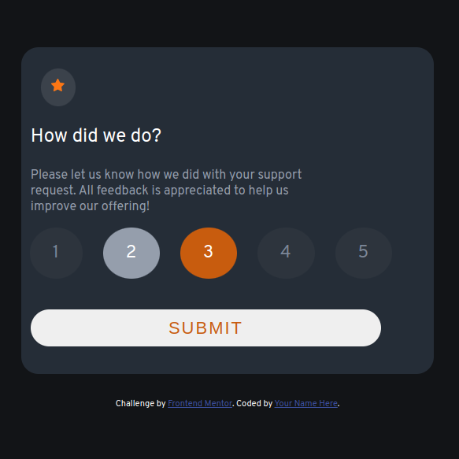
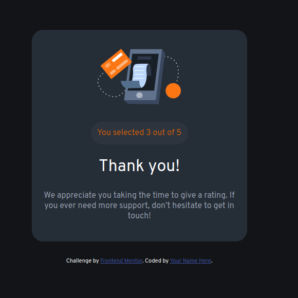

# Frontend Mentor - Interactive rating component solution

This is a solution to the [Interactive rating component challenge on Frontend Mentor](https://www.frontendmentor.io/challenges/interactive-rating-component-koxpeBUmI). Frontend Mentor challenges help you improve your coding skills by building realistic projects.

## Table of contents

  - [The challenge](#the-challenge)
  - [Screenshot](#screenshot)
  - [Links](#links)
  - [Built with](#built-with)
  - [Author](#author)

### The challenge

Users should be able to:

- View the optimal layout for the app depending on their device's screen size
- See hover states for all interactive elements on the page
- Select and submit a number rating
- See the "Thank you" card state after submitting a rating

### Screenshot

### Links

- Solution URL: [Add solution URL here](https://your-solution-url.com)
- Live Site URL: [see the site](https://astonishing-belekoy-ffe2fa.netlify.app/)

### Built with

- Semantic HTML5 markup
- CSS custom properties
- Vanila JavaScript

## Author

- myportfolio - [Katerina Sarantopoulou](https://myportfolio-katesarant.netlify.app/)
- Frontend Mentor - [@kate-sarant](https://www.frontendmentor.io/profile/kate-sarant)
- Github - [kate-sarant](https://github.com/kate-sarant)
